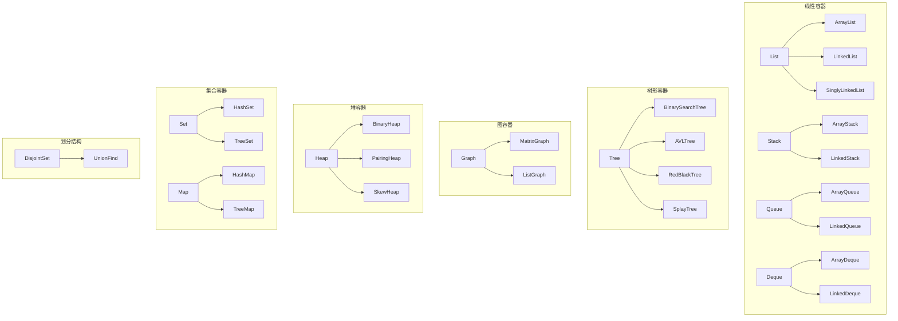

# HelloDS

_C++ 实现的基础数据结构模板代码库_

> 优雅，实在是太优雅了！

## 1. 基本属性

- 名称：HelloDS，意为 **Hello** **D**ata **S**tructure
- 语言：C++，满足 C++23 标准
- 目标：实现一套便于学习、收藏、展示的基础数据结构模板代码；不使用任何标准库容器；支持迭代器
- 模块：List, Stack, Queue, Deque, Heap, Tree, Graph, Set, Map, DisjointSet
- 简洁：Stay simple, stay young. 在保证健壮的前提下，尽量简洁，便于维护和阅读
- 健壮：安全的扩容机制，防止溢出。对容器的增删改查都有相应的检查
- 风格：大部分遵循 [Google C++ Style Guide](https://google.github.io/styleguide/cppguide.html) ，小部分基于项目规模和源码简洁性的考虑采用自己的风格
- 测试：使用 [Catch2](https://github.com/catchorg/Catch2) 进行了测试，确保测试全部通过
- 安全：使用 [Dr. Memory](https://drmemory.org) 进行了检查，确保没有安全问题
- 文档：使用 [Doxygen](https://www.doxygen.nl) 生成文档
- 构建：使用 [XMake](https://xmake.io) 进行构建

### 项目亮点

- 零标准库容器依赖：全部容器和迭代器均从零实现，展示完整的实现思路与细节
- 统一的迭代器体系：基于 Concept + Model 实现类型擦除迭代器，全容器统一迭代器接口
- 完备的生命周期：所有容器均实现了 Rule of Five，资源管理安全可靠

### 模块一览



### 核心特性

| 容器               | 底层结构 | 特征                            | 亮点                     |
| ------------------ | -------- | ------------------------------- | ------------------------ |
| `ArrayList`        | 动态数组 | 随机访问 O(1)，尾部追加快       | -                        |
| `LinkedList`       | 双向链表 | 插入删除节点高效                | 缓存实现访问加速         |
| `SinglyLinkedList` | 单向链表 | 内存占用低，仅支持正向遍历      | -                        |
| `ArrayStack`       | 动态数组 | LIFO，尾部 push/pop 高效        | -                        |
| `LinkedStack`      | 双向链表 | LIFO，适合频繁动态扩缩容        | -                        |
| `ArrayQueue`       | 循环数组 | FIFO，环形缓冲区                | -                        |
| `LinkedQueue`      | 双向链表 | FIFO，适合频繁动态扩缩容        | -                        |
| `ArrayDeque`       | 循环数组 | 头尾操作均为 O(1) 摊还          | 迭代器自动处理环形绕回   |
| `LinkedDeque`      | 双向链表 | 头尾插删高效                    | -                        |
| `BinaryHeap`       | 动态数组 | 堆顶访问高效，适合优先级场景    | 模板支持大顶堆和小顶堆   |
| `PairingHeap`      | 多叉树   | 支持 O(1) 摊还插入              | 基于 meld 操作，实现极简 |
| `SkewHeap`         | 二叉树   | 自调整结构，不存额外平衡信息    | 代码最精简的 meld 堆     |
| `BinarySearchTree` | 二叉树   | 中序遍历有序，查找平均 O(log N) | 虚拟最大节点简化双向迭代 |
| `AVLTree`          | 二叉树   | 严格平衡，查找性能稳定          | -                        |
| `RedBlackTree`     | 二叉树   | 近似平衡，更新操作代价低        | -                        |
| `SplayTree`        | 二叉树   | 访问热点会被逐步伸展到上层      | -                        |
| `MatrixGraph`      | 邻接矩阵 | 稠密图友好，边查询 O(1)         | -                        |
| `ListGraph`        | 邻接表   | 稀疏图友好，适合遍历邻边        | -                        |
| `HashSet`          | 散列表   | O(1) 查找，无重复元素           | -                        |
| `TreeSet`          | 二叉树   | 元素有序，支持范围相关操作      | -                        |
| `HashMap`          | 散列表   | O(1) 键查找与更新               | 正负交替二次探测缓解聚集 |
| `TreeMap`          | 二叉树   | 键有序，支持有序映射操作        | -                        |
| `UnionFind`        | 树形数组 | 路径压缩 + 按秩合并 O(α(N))     | 模板支持任意类型         |

### 时间复杂度

**List**

|                    | `operator[]`     | `append`  | `insert` | `remove` |
| ------------------ | ---------------- | --------- | -------- | -------- |
| `ArrayList`        | O(1)             | O(1) 摊还 | O(N)     | O(N)     |
| `LinkedList`       | O(N)<sup>†</sup> | O(1)      | O(N)     | O(N)     |
| `SinglyLinkedList` | O(N)             | O(1)      | O(N)     | O(N)     |

<sup>†</sup> 带最近访问缓存，时间局部性好时接近 O(1)<br>

**Stack**

|               | `push`    | `pop` | `top` |
| ------------- | --------- | ----- | ----- |
| `ArrayStack`  | O(1) 摊还 | O(1)  | O(1)  |
| `LinkedStack` | O(1)      | O(1)  | O(1)  |

**Queue**

|               | `enqueue` | `dequeue` | `front` |
| ------------- | --------- | --------- | ------- |
| `ArrayQueue`  | O(1) 摊还 | O(1)      | O(1)    |
| `LinkedQueue` | O(1)      | O(1)      | O(1)    |

**Deque**

|               | `push_front` | `push_back` | `pop_front` | `pop_back` |
| ------------- | ------------ | ----------- | ----------- | ---------- |
| `ArrayDeque`  | O(1) 摊还    | O(1) 摊还   | O(1)        | O(1)       |
| `LinkedDeque` | O(1)         | O(1)        | O(1)        | O(1)       |

**Heap**

|               | `peek` | `push`        | `pop`         | `meld`        |
| ------------- | ------ | ------------- | ------------- | ------------- |
| `BinaryHeap`  | O(1)   | O(log N)      | O(log N)      | O(N log N)    |
| `PairingHeap` | O(1)   | O(1) 摊还     | O(log N) 摊还 | O(1)          |
| `SkewHeap`    | O(1)   | O(log N) 摊还 | O(log N) 摊还 | O(log N) 摊还 |

**Tree**

|                    | `find`        | `insert`      | `remove`      |
| ------------------ | ------------- | ------------- | ------------- |
| `BinarySearchTree` | O(log N) 平均 | O(log N) 平均 | O(log N) 平均 |
| `AVLTree`          | O(log N)      | O(log N)      | O(log N)      |
| `RedBlackTree`     | O(log N)      | O(log N)      | O(log N)      |
| `SplayTree`        | O(log N) 摊还 | O(log N) 摊还 | O(log N) 摊还 |

**Set**

|           | `find`    | `insert`  | `remove`  |
| --------- | --------- | --------- | --------- |
| `HashSet` | O(1) 平均 | O(1) 平均 | O(1) 平均 |
| `TreeSet` | O(log N)  | O(log N)  | O(log N)  |

**Map**

|           | `find`    | `insert`  | `remove`  | `operator[]` |
| --------- | --------- | --------- | --------- | ------------ |
| `HashMap` | O(1) 平均 | O(1) 平均 | O(1) 平均 | O(1) 平均    |
| `TreeMap` | O(log N)  | O(log N)  | O(log N)  | O(log N)     |

**Graph**

|               | `link` / `unlink` | `distance` | DFS / BFS        | `dijkstra`       |
| ------------- | ----------------- | ---------- | ---------------- | ---------------- |
| `MatrixGraph` | O(1)              | O(1)       | O(V<sup>2</sup>) | O(V<sup>2</sup>) |
| `ListGraph`   | O(V)              | O(V)       | O(V + E)         | O((V + E) log V) |

**DisjointSet**

|             | `find`  | `unite` | `is_connected` |
| ----------- | ------- | ------- | -------------- |
| `UnionFind` | O(α(N)) | O(α(N)) | O(α(N))        |

说明：

记号：`N` 表示输入数据规模，图论中 `V` 表示顶点数，`E` 表示边数。

摊还：单次操作可能较慢（如触发了扩容），但多次操作的平均代价为该复杂度。

平均：输入分布理想情况下的期望复杂度。比如，对散列表指哈希均匀分布；对 BST 指随机插入。

链式实现的常数时间通常高于数组实现（指针间接访问、缓存不友好），同一复杂度的链式实际运行时间可能更长。

## 2. 使用说明

可以看 [examples](./examples/) 。

| 示例                        | 主要容器      | 算法/场景         |
| --------------------------- | ------------- | ----------------- |
| `calculator.cpp`            | `ArrayStack`  | 中缀表达式求值    |
| `simulate_bank_queuing.cpp` | `ArrayQueue`  | 多窗口排队模拟    |
| `metro_planner.cpp`         | `MatrixGraph` | Dijkstra 最短路径 |

运行示例和测试：

```
xmake run example
xmake run test
```

运行 xmake run example 后进入菜单；运行 xmake run test 会执行所有测试。

其实最大的用处就是通过源码来学习/收藏/展示数据结构。

如果你想要实用的容器库/类型库，可以看看我的另一个项目：[PyInCpp](https://github.com/chen-qingyu/pyincpp)。

## 3. 开发历史

这个项目始于 2019 年，当时自学数据结构边学边写的，用的 C 语言，当做练手项目。起源详情请见： https://zhuanlan.zhihu.com/p/92786307 。因为本科专业并不是计算机，所以当时没有学软件工程，写出来的代码只是能用，但是非常不优雅。后来接触到了面向对象思想和软件工程实践，我把整个项目推翻重写了好几次。2023年完成了第一版。

最开始那几年我根本没有把这个项目开源的想法，因为我觉得这只是我的一个个人练手作品，网上一搜一大把，没什么开源价值。但是后来陆陆续续把它功能写得很完善的时候，我发现其中有些功能的实现互联网上基本搜不到，比如字符串转数字（类似标准库的 atof ，但是这个库不依赖 string.h ，没错我是重新造轮子），我能找到的都不能与标准库相媲美，各种瑕疵（不能处理类似 ".123e-2" 这种情况，或者不能识别 nan 以及 inf ），而有些又太冗杂（各种 if else 嵌套），我想了两天最后用 FPGA 里面的独热码思想结合有限状态机实现了（后来把 `String` 合并到 `PyInCpp` 里去了，因为 `String` 严格来说不算数据结构而算数据类型）。类似的还有许多，都是我在日积月累的学习中一行一行写出来的。有时候是灵光乍现（比如`String_ToDecimal, String_ToInteger`的独热码结合有限状态机），有时候是从其他语言的标准库中得到的启发（比如`String_From`的命名仿照 Rust 标准库中 String 的 from 方法），有时候是网友给的建议（比如`DoublyLinkedList_At`的内部状态指针加速访问）。

因为二叉树的中序遍历需要用到队列，而 C 语言无法简洁地实现泛型，所以之前一直是把队列函数源码复制一份当成`static`的然后 `typedef const struct BinarySearchTreeNode* ArrayQueueItem;` 手动模拟泛型，但这样太不优雅了，2024 年用 C++ 重写了，发布了v2.0.0，原先的 C 语言版本保留在 branch v1 中。

2025 年持续迭代，新增了许多数据结构，打磨了许多细节。

2026 年引入了基于 Concept + Model 的类型擦除迭代器，统一了所有容器的迭代器接口，大幅简化了代码。然后新增了一些新的数据结构，同时对项目进行了全面的 C++23 合规性加固和优化。

项目已经很优雅了，我猜认真阅读代码的人都会发出一句感叹："优雅！"。
